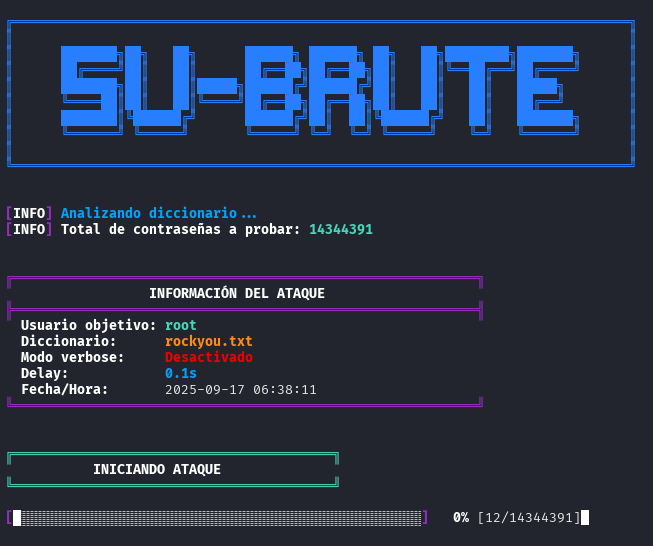
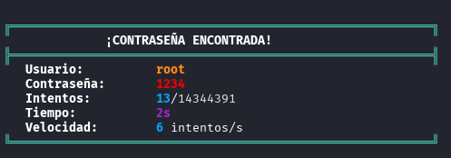

# su-brute.sh: Script de Fuerza Bruta para `su`


Un script de shell para realizar ataques de fuerza bruta por diccionario contra el comando `su` en sistemas Linux.

## Características principales

*   **Ataque de diccionario:** Prueba contraseñas desde un archivo de texto.
*   **Modo Verbose:** Muestra cada intento de contraseña en tiempo real.
*   **Delay configurable:** Permite establecer un retardo entre intentos para evitar bloqueos.
*   **Barra de progreso:** Visualiza el avance del ataque.
*   **Diseño:** Interfaz colorida y un banner informativo.
*   **Manejo de interrupciones:** Permite cancelar el ataque de forma segura (Ctrl+C) y ver el resumen.
*   **Información del ataque:** Muestra detalles como el usuario objetivo, el diccionario y la configuración.

## Instalación / Uso rápido

1.  Clona el repositorio:
    ```bash
    git clone --depth=1 https://github.com/Gh0stCr0w/su-brute.git ; cd "su-brute" ; chmod +x su-brute.sh
    ```

2.  Ejecuta el script con la siguiente sintaxis:
    ```bash
    ./su-brute.sh [OPCIONES] USUARIO DICCIONARIO
    ```

### Argumentos

- **`USUARIO`**: El nombre del usuario objetivo en el sistema.
- **`DICCIONARIO`**: La ruta al archivo de diccionario que se utilizará para el ataque.

### Opciones

| Opción           | Alias       | Descripción                                               |
| ---------------- | ----------- | --------------------------------------------------------- |
| `-v`, `--verbose`  |             | Activa el modo verbose, mostrando cada intento de contraseña. |
| `-d`, `--delay`    | `<segundos>` | Establece el tiempo de espera (en segundos) entre cada intento. |
| `-h`, `--help`     |             | Muestra el menú de ayuda.                                 |

### Ejemplos:

- **Ataque básico:**

  ```bash
  ./su-brute.sh root rockyou.txt
  ```

- **Ataque en modo verbose:**

  ```bash
  ./su-brute.sh -v root rockyou.txt
  ```

- **Ataque con un delay de 0.5 segundos entre intentos:**

  ```bash
  ./su-brute.sh -d 0.5 root rockyou.txt
  ```
  
- **Ataque en modo verbose con un delay de 0.5 segundos entre intentos:**

  ```bash
  ./su-brute.sh -v -d 0.5 root rockyou.txt
  ```
  

## Salida esperada

**Inicio del ataque:**



**Contraseña encontrada:**



## Advertencias

**Propósito Educativo:** Este script está diseñado para fines educativos y para auditar la seguridad de 

